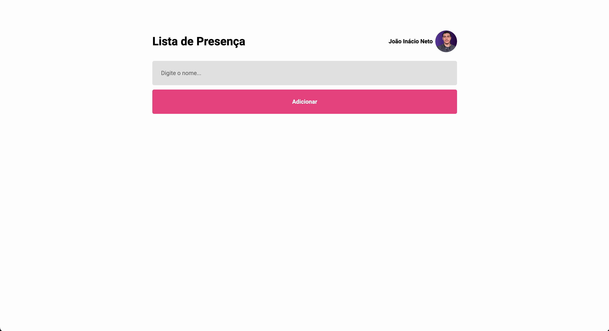

<p align="center">
  
</p>

<p align="center">
  
  
  

  
</p>

## 🧪 Technologies

This project was developed using the following technologies:

- [ReactJS](https://reactjs.org/)
- [Vite](https://vitejs.dev/)

## 🚀 Getting started

Clone the project and access the folder.

```bash
git clone https://github.com/birobirobiro/lista-de-presenca

cd lista-de-presenca

```

Run this command to install the dependencies.

```bash
yarn install

yarn dev
```

## 📝 License

This project is licensed under the MIT License. See the [LICENSE](LICENSE) file for details.

---

Made with 💜 by [birobirobiro](https://www.birobirobiro.dev) 👋
